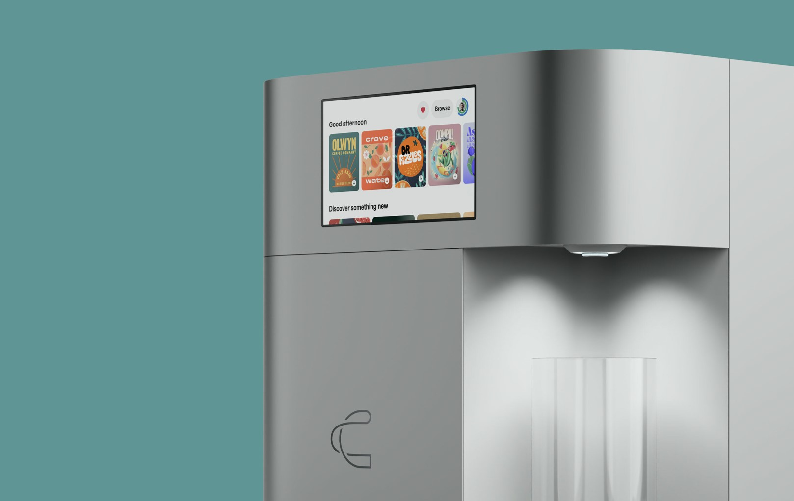
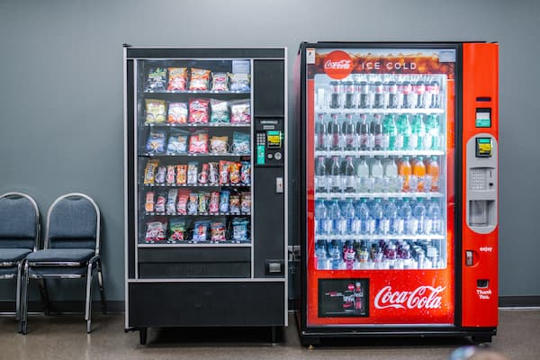

# Web-Design-CANA-Molecular-Drinking-Machine
## 網頁基本設定-index 
### 一、網頁描述設定
#### 設定在搜尋結果顯示的網站簡介文字
```=html
<meta description="CANA分子飲料機
                   ,透過分子墨水匣印出各種飲品風味
                   ,不論是果汁、提神飲料、高蛋白飲、雞尾酒、啤酒
                   ,上千種你想得到想不到的口味
                   ,都可以用CANA分子飲料機自製而成">
```
### 二、網頁關鍵字設定
#### 選用不會和其他網頁重複的關鍵詞彙，提高搜尋引擎排名
```=html
<meta name="keywords" 
      content="CANA Technology,
               CANA,
               CANA分子飲料機,
               分子墨水匣,
               自製飲料口味">
```
### 三、網頁標題title
#### 英文+中文命名，提高被搜尋到的機率
```=html
    <title>CANA Technology-分子飲料機</title>
```

### 四、網址列前icon圖設定
#### 指定將img資料夾中，"website.png"這張圖片設定為網址列前的icon縮圖
```=html
    <link rel="shortcut icon" href="img/website.png">
```

---
## 首頁設定-index 
### 一、首頁背景圖片
1. 引用"主選門面照.jpg"，即分子飲料機作為背景圖片
1. 背景圖片之格式設定引用"mainpic"
```=html
    
```
#### mainpic用來規範首頁背景圖片呈現方式:圖片寬度與頁面同寬、設置於頁面最底層
```=css
.mainpic {
  position: absolute;
  /* 以body本身為基準做對齊 */
  background-size: cover;
  /* 圖片寬度填滿畫面 */
  z-index: -1;
  /* 用來排定順序,數值大的在前 */
  width: 100%;
}
```

### 二、首頁MENU選單
1. 外層div區塊將"回首頁"、"門市據點"、"關於我們"、"產品介紹"、"登入/註冊"共5個MENU選項，以及搜尋欄位包起來

1. 內層的div區塊將"產品介紹中"的3個子選項包起來:分子飲料機使用方法、可製成飲品總覽、訂閱方案
```=html
<div class="fixbox">
      <div class="fixbox2">

        <div class="topnav">
          <a href="#home" class="active">
          CANA </a>
          <a href="#news">門市據點</a>
          <a href="index-about.html">關於我們</a>
          <div class="dropdown">
            <button class="dropbtn">產品介紹</button>
            <div class="dropdown-content">
              <a href="#intro1">分子飲料機使用方法</a>
              <a href="#intio2">可製成飲品總覽</a>
              <a href="#intro3">訂閱方案</a>
            </div>
          </div>
          <a href="index-login.html">登入/註冊</a>
          <input type="text" placeholder="想找些什麼..">
        </div>

      </div>
    </div>
```
### 三、首頁輪播廣告-共3張，以第1張舉例
1. 廣告輪播形式採"mySlides fade"設定
3. 引用img資料夾中的圖片，作為廣告輪播用的圖片，圖片呈現形式採"slideImg"設定
5. Call to Action按鈕呈現形式採"btn"設定
```=html
<div class="mySlides fade">
          
          <div class="text">只有你想不到的優惠<br>
          沒有你調不出的風味 </div>
          <button class="btn">搶先體驗</button>
        </div>
```
#### 輪播廣告呈現之圖片，寬度需100%占滿版面
```=css
.slideImg {
  width: 100%
}
```
#### Call to Action行動呼籲按鈕"btn"設定
1. color:設定按鈕上方文字設定為白色
1. text-shadow:設定按鈕上方文字，具備黑色陰影特效
2. background-color:設定按鈕為#ffcc00色號
3. cursor:游標移動至按鈕，按鈕會變色
```=css
.btn {
  color: #f5f5f5;
  font-size: 20px;
  text-shadow: 2px 3px 5px black;
  position: absolute;
  bottom: 150px;
  left: 290px;
  padding: 12px 30px;
  background-color: #ffcc00;
  border: none;
  cursor: pointer;
  /* 游標種類 */
}
```

### 四、首頁輪播廣告-頁面切換設定
1. 用span把3個圓點包起來，點擊這3個圓點，可直接連結到廣告輪播頁面
1. 最左邊的圓點連結到第1個廣告輪播頁面；中間的圓點連結到第2個廣告輪播頁面，最右邊的圓點連接到第3個廣告輪播頁面
1. 最後用一個置中的div標籤把包含3個圓點的span包起來
```=html
<div style="text-align:center">
        <span class="dot" onclick="currentSlide(1)"></span>
        <span class="dot" onclick="currentSlide(2)"></span>
        <span class="dot" onclick="currentSlide(3)"></span>
      </div>
```
### 五、將頁尾平均切成3塊
1. 先將頁尾平均切成3塊
1. 這3塊會分別放上img資料夾中的圖片
1. 每張圖片上方會套用"overlay"圖層疊加特效，使圖片產生霧面感
2. 圖層疊加特效上方再顯示文字，文字樣式設定為"overtext"

```=html
<div class="column col-4">
          <div style="position: relative;">
            
            <div class="overlay">
              <div class="overtext">
                <h4>販賣機中永遠沒賣你最愛喝的那瓶飲料</h4><br>
                <h3>那就用CANA分子飲料機!</h3><br>
                <h1># 酸甜苦，你做主</h1>
              </div>
            </div>
          </div>
        </div>
```
#### "overlay"圖層疊加特效說明
1. background-color: rgba(0, 61, 76, 0.8)設定疊加在上方的圖層顏色
1. transition:游標移動至圖層上方，圖層在0.5秒內會變色
```=css
.overlay {
  position: absolute;
  background-color: rgba(0, 61, 76, 0.8);
  width: 100%;
  height: 100%;
  top: 0;
  transition: all 0.5s ease-in-out;
}
```
```=css
.overlay:hover {
  background-color: rgba(0, 61, 76, 0.3);
  transition: all 0.5s ease-in-out;
}
```
---
## "登入/註冊"頁面設定-index login
### 一、註冊表單設定
#### Email欄位預設顯示user@example.com
```=html
<label for="email"><b>帳號Email</b></label>
            <input type="text" value="user@example.com" 
            name="email" required>
```
#### 密碼欄位預設顯示"至少8個字元 需包含數字與大小寫字母" 文字
```=html
<label for="psw"><b>密碼Password</b></label>
            <input type="password" placeholder="至少8個字元 
            需包含數字與大小寫字母" name="psw" required>
```
